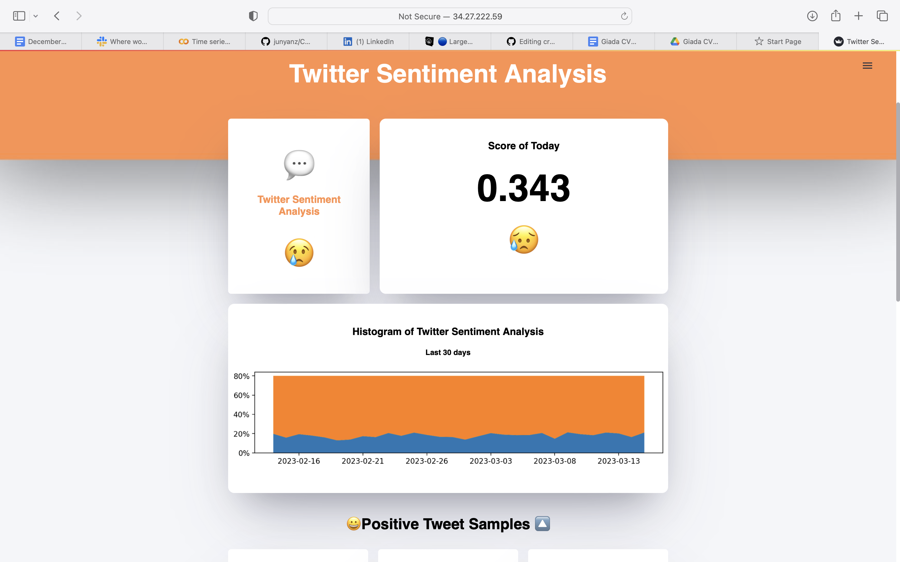
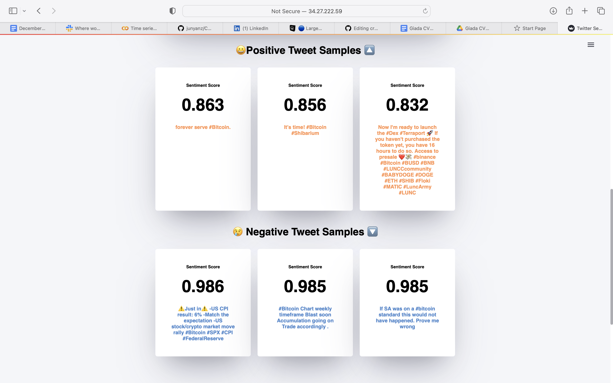
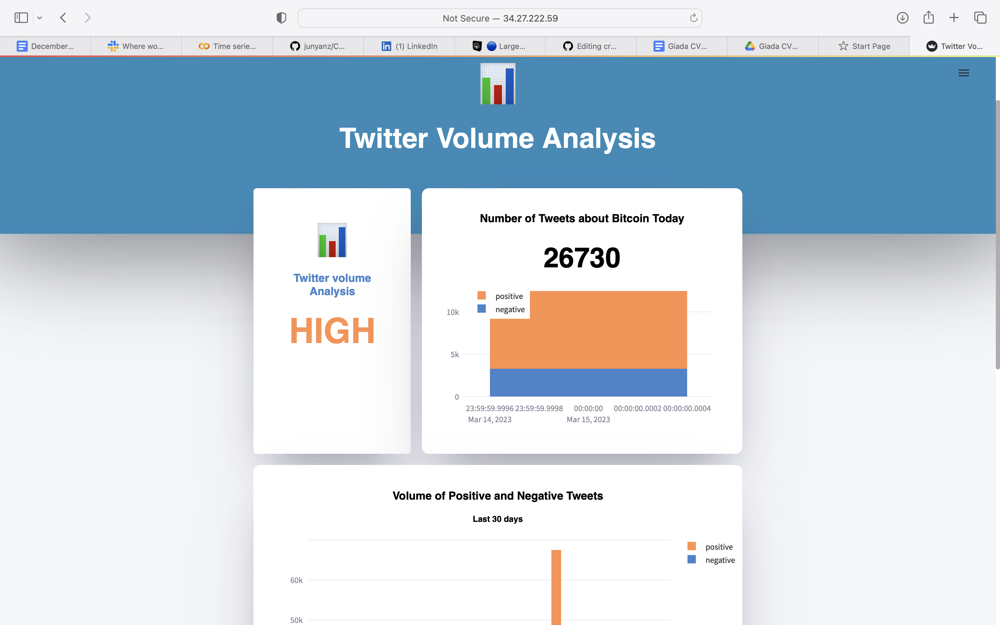
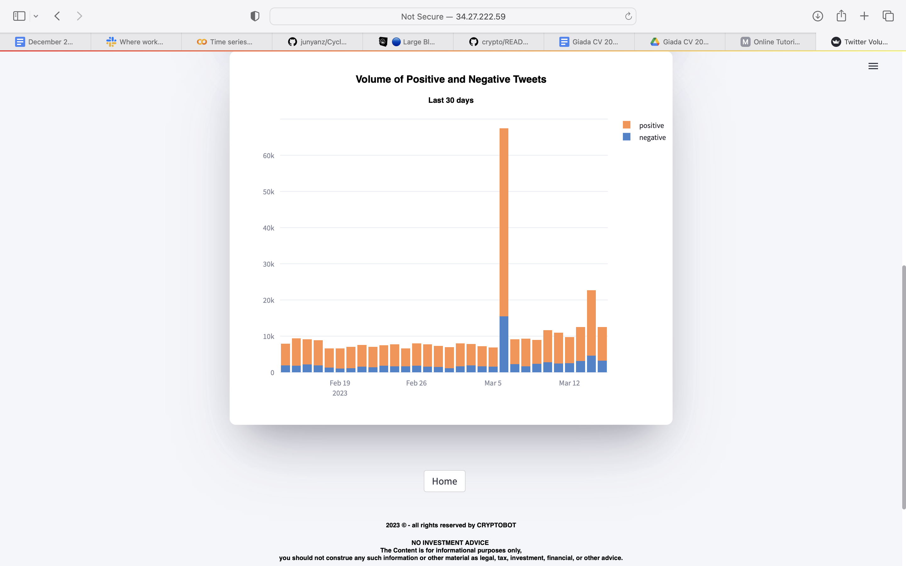
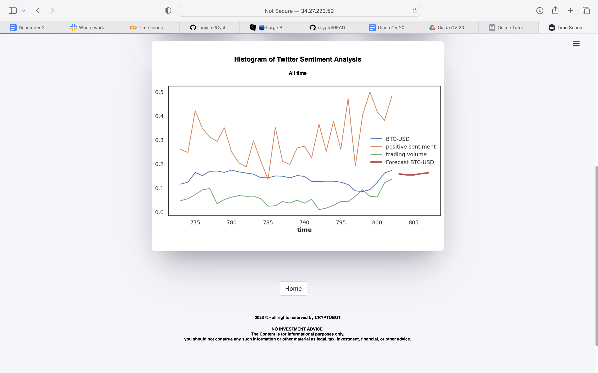

# cryptobot
## Motivation for project:
#### Cryptocurrency markets are notoriously volatile, yet lucrative. Since the vast majority of cryptocurrencies are not based on any tangible assets, their value is strongly correlated to the way people feel about them.
## Overview:
#### Cryptobot used a preexisting NLP model to give a sentimentality rating to Tweets, to give an indication of sentiment on a daily basis, over a 2.5 year period. This data showed that tweet sentiment does indeed have a bearing on the price of Bitcoin. A time series was created using a Block Recurrent Neural Network, using our Tweet sentiment data and other key data, we were able to generate 2 day predications with a MAPE of 4.5%. Volume of Bitcoin tweets was also examined and used as a measure of how significant the sentimentality rating for a given day was. 

### Demo :thumbsup:

